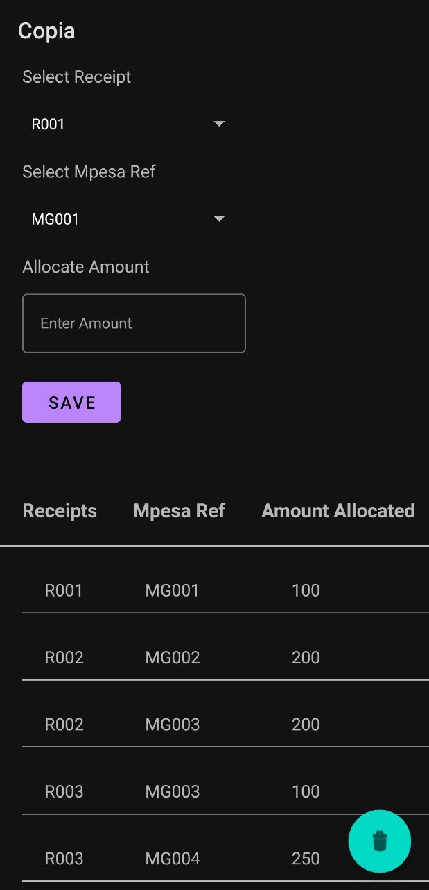
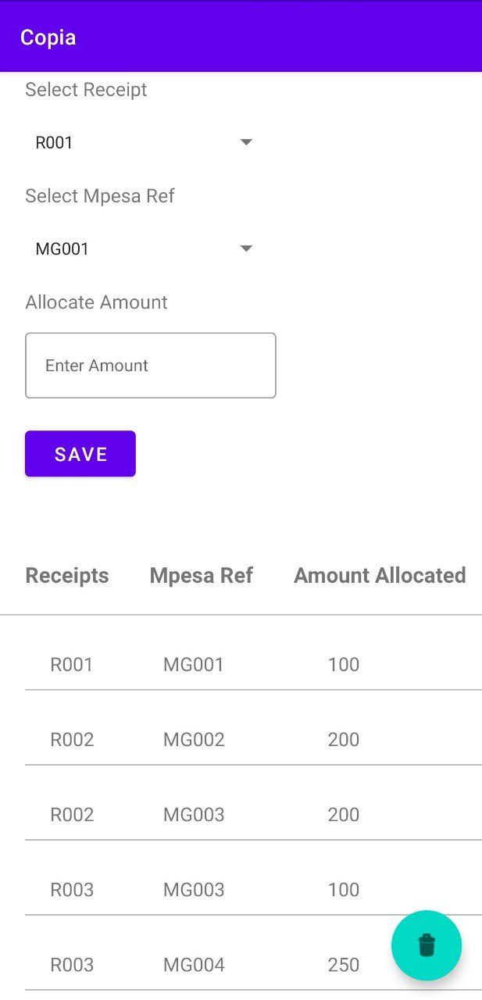

# Copia
Technical Android Interview (Section 2)

## Table of Contents

- [Libraries](#libraries)
- [Screenshots](#screenshots)

## Libraries.
- [Room]() - Provides an abstraction layer over SQLite used for offline data caching.
- [kotlinx.coroutines](https://github.com/Kotlin/kotlinx.coroutines) - Library Support for coroutines.
- [Jetpack](https://developer.android.com/jetpack)
  - [Viewmodel](https://developer.android.com/topic/libraries/architecture/viewmodel) - Manage UI related data in a lifecycle conscious way .
  - [Data Binding](https://developer.android.com/topic/libraries/data-binding) - Support library that allows binding of UI components in  layouts to data sources.
  
## Screenshots.

  